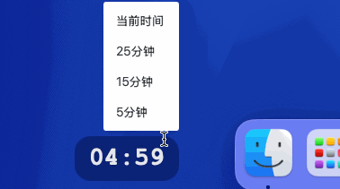

# YiKe 时钟

桌面透明时间，带简易番茄计时器，可自由拖动。

## 效果示例



## 下载

[Download](https://github.com/Baiyuetribe/yike/releases)

## WIP

- [ ] LOGO 设计
- [ ] Windows 适配
- [ ] linux 适配

## 灵感来源

ctime，但缺点是仅有 Windows 端。

## 开发

```bash
# 开发
git clone https://github.com/Baiyuetribe/yike.git
cd yike
bun install
bun run gui

# 打包
bun run build
```
